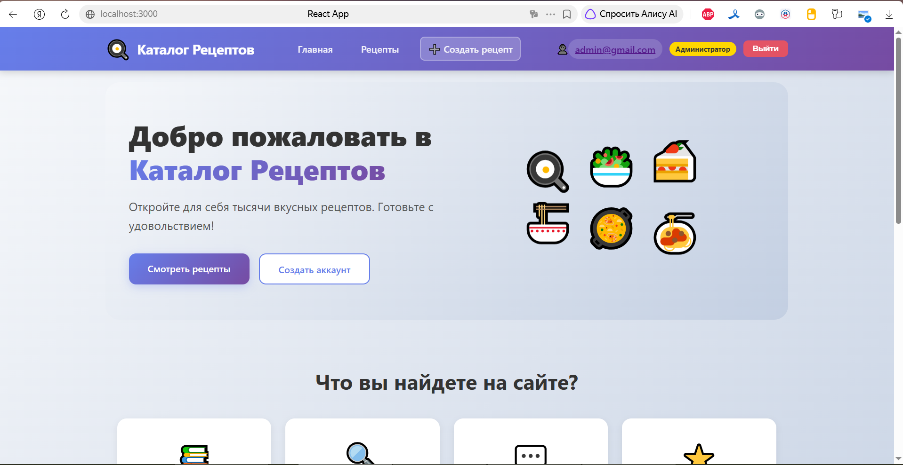
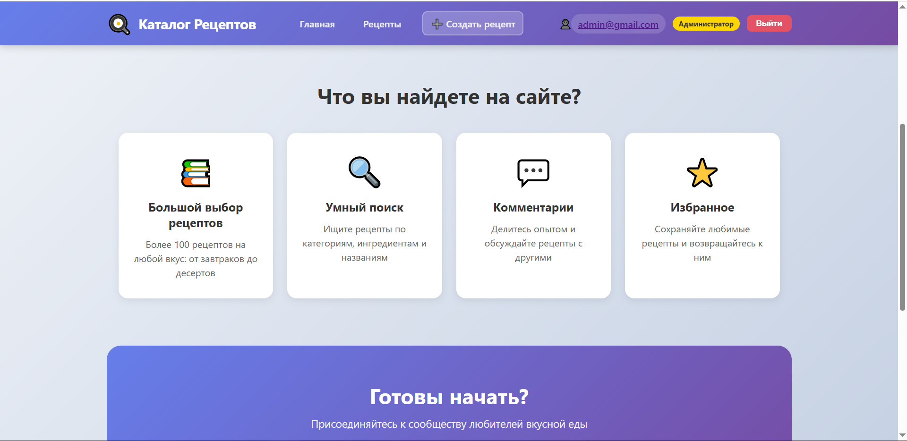
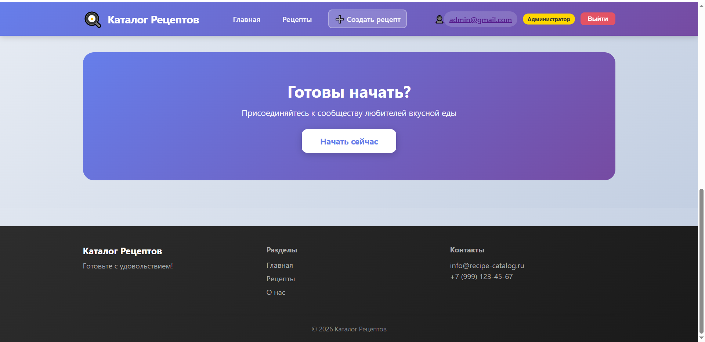
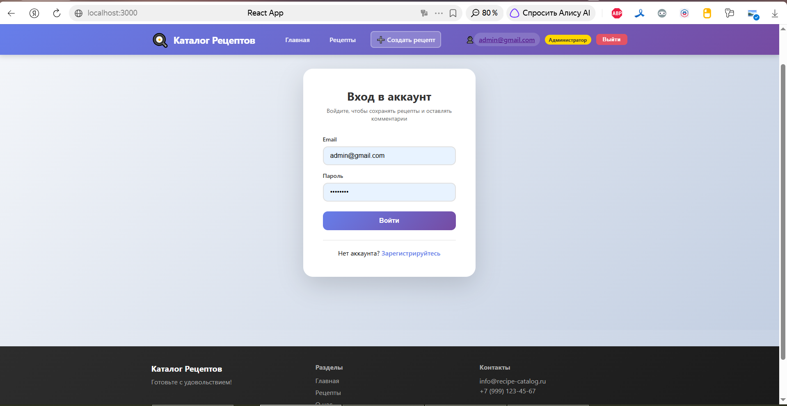
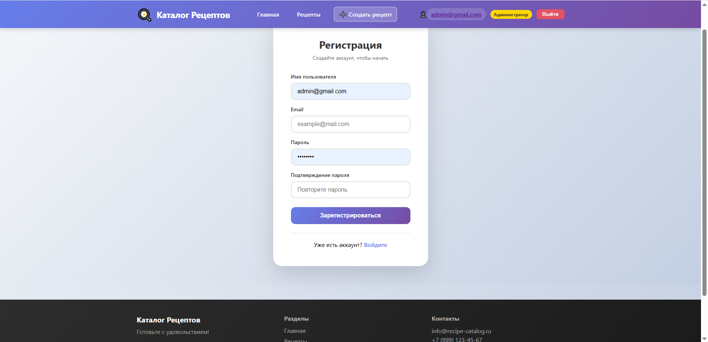
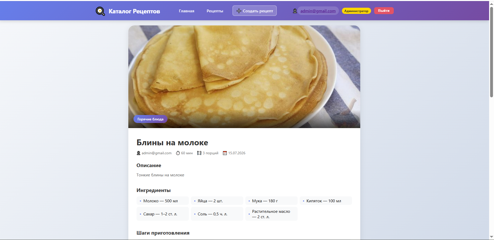
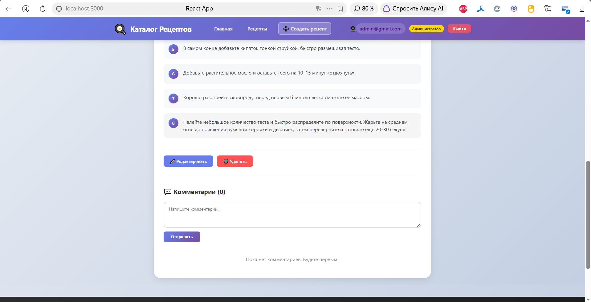
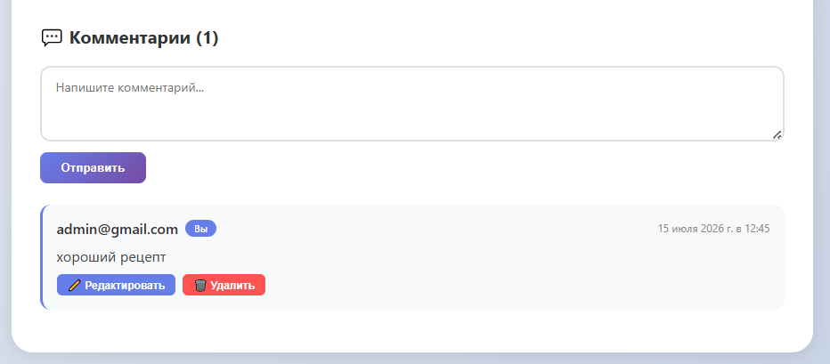
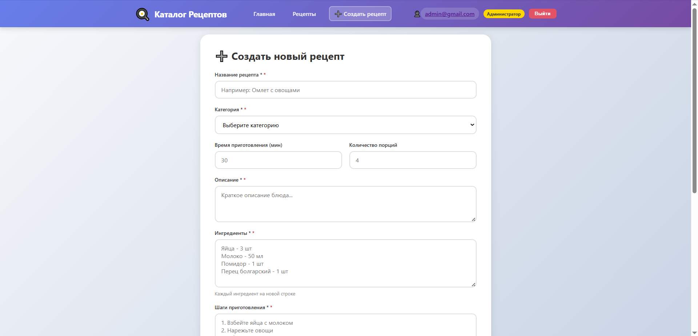
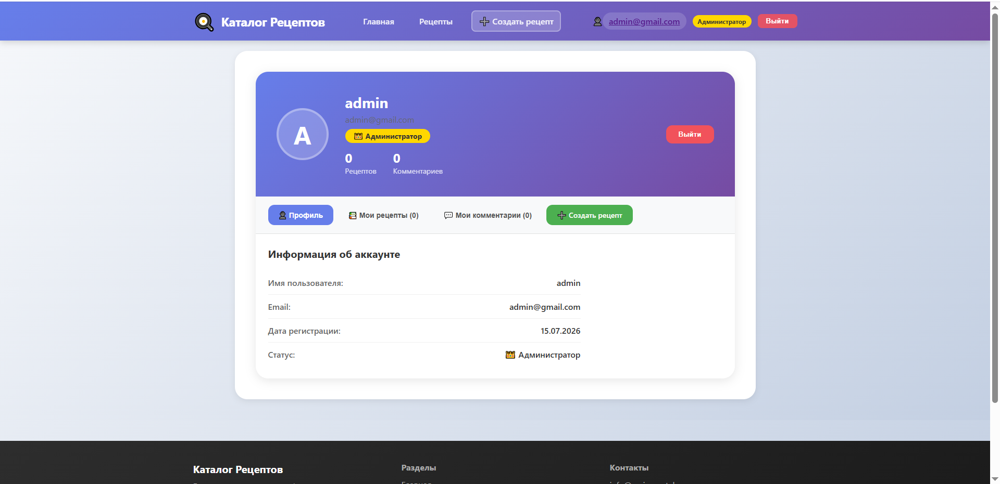

# 🍳 Каталог Рецептов

Веб-приложение для поиска и публикации кулинарных рецептов с системой комментариев и авторизацией.

## 📸 Скриншоты











## ✨ Особенности

- 📚 **Каталог рецептов** - просмотр всех рецептов с фильтрацией по категориям
- 🔍 **Поиск** - быстрый поиск рецептов по названию
- 👤 **Авторизация** - регистрация и вход с JWT токенами
- 💬 **Комментарии** - возможность оставлять, редактировать и удалять комментарии
- 🛡️ **Ролевая система** - гости, пользователи и администраторы с разными правами
- 📱 **Адаптивный дизайн** - работает на всех устройствах
- 🖼️ **Загрузка изображений** - добавление фото к рецептам
- 👑 **Админ-панель** - управление рецептами, категориями и комментариями

## 🛠️ Технологии

### Backend
- Django 4.x
- Django REST Framework
- JWT Authentication (SimpleJWT)
- SQLite (по умолчанию, можно заменить на PostgreSQL/MySQL)
- Django CORS Headers

### Frontend
- React 18
- React Router v6
- Axios
- CSS Modules

## 📋 Требования

- Python 3.8+
- Node.js 14+
- npm или yarn
- Git

## 🚀 Быстрый старт

### 1. Клонирование репозитория

```bash
git clone https://github.com/sharina-ya/react-recipe_book.git
cd react-recipe_book
```

### 2. Настройка бэкенда

#### 2.1 Создание виртуального окружения

```bash
cd backend
python -m venv venv

# Для Windows:
venv\Scripts\activate

# Для Mac/Linux:
source venv/bin/activate
```

#### 2.2 Установка зависимостей

```bash
pip install -r requirements.txt
```

Если файла `requirements.txt` нет, установите вручную:

```bash
pip install django djangorestframework django-cors-headers Pillow djangorestframework-simplejwt
pip freeze > requirements.txt
```

#### 2.3 Применение миграций

```bash
python manage.py makemigrations users
python manage.py makemigrations recipes
python manage.py makemigrations comments
python manage.py migrate
```

#### 2.4 Создание суперпользователя (администратора)

```bash
python manage.py createsuperuser
```

Введите:
- **Email**: admin@example.com
- **Username**: admin
- **Password**: admin123 (или придумайте свой)

#### 2.5 Заполнение базы данных начальными данными (опционально)

```bash
python manage.py shell
```

В shell выполните:

```python
from recipes.models import Category

categories = ['Завтраки', 'Супы', 'Салаты', 'Горячие блюда', 'Десерты', 'Напитки', 'Выпечка', 'Быстрые рецепты']
for cat in categories:
    Category.objects.get_or_create(
        name=cat,
        defaults={'slug': cat.lower().replace(' ', '-')}
    )
exit()
```

#### 2.6 Запуск бэкенда

```bash
python manage.py runserver
```

Сервер будет доступен по адресу: http://127.0.0.1:8000/

### 3. Настройка фронтенда

#### 3.1 Установка зависимостей

```bash
cd ../frontend
npm install
```

#### 3.2 Запуск фронтенда

```bash
npm start
```

Приложение будет доступно по адресу: http://localhost:3000/

### 4. Готово!

Откройте браузер и перейдите по адресу: http://localhost:3000/


## 🎯 Основные функции

### Для гостей (неавторизованных пользователей)
- Просмотр главной страницы
- Просмотр списка рецептов
- Просмотр карточек рецептов
- Поиск и фильтрация рецептов
- Просмотр комментариев

### Для пользователей (авторизованных)
- Все возможности гостей
- Личный кабинет
- Оставление комментариев
- Редактирование и удаление своих комментариев
- Просмотр своих рецептов и комментариев

### Для администраторов
- Все возможности пользователей
- Создание, редактирование и удаление рецептов
- Управление категориями
- Удаление любых комментариев


## 👩‍💻 Автор

**Sharina Ya**

- GitHub: [@sharina-ya](https://github.com/sharina-ya)

**Приятного использования! **